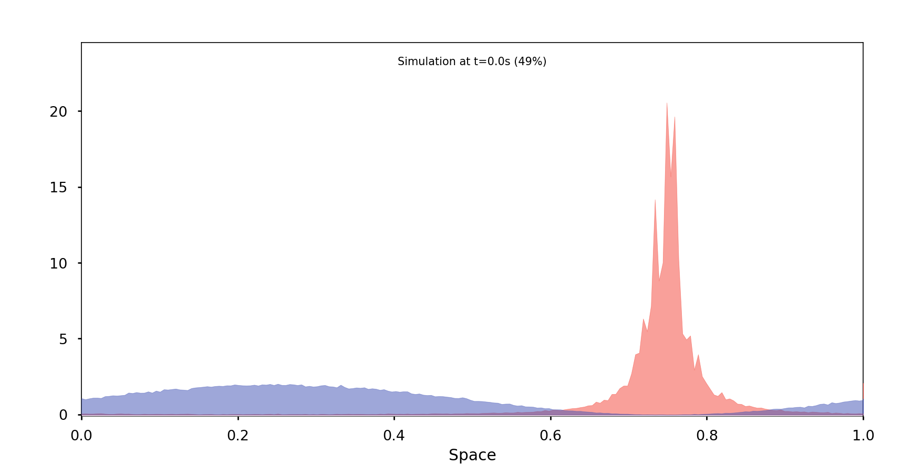

# PSC MArkov Stochastics

Stochastic simulation of advanced 1D population dynamics, based on the Sheguesada Kawazaki Teramoto (SKT) model.
In this project, we comparearively solved the SKT model system for stationary solutions using stochastic simulations and deterministic methods. [[Theory and Results Presetation (French)]](./misc/PSC.pdf))

 

## Results

Comparative observations at three stages of the population dynamics, given an 'intruder' initial scenario:

Deterministic | Stochastic
--- | ---
 | 
 | 
 | 

## Benchmark

As a benchmark, here is a dynamic simulation of stationary and deterministic solution of the SKT model given a specific initial scenario:

