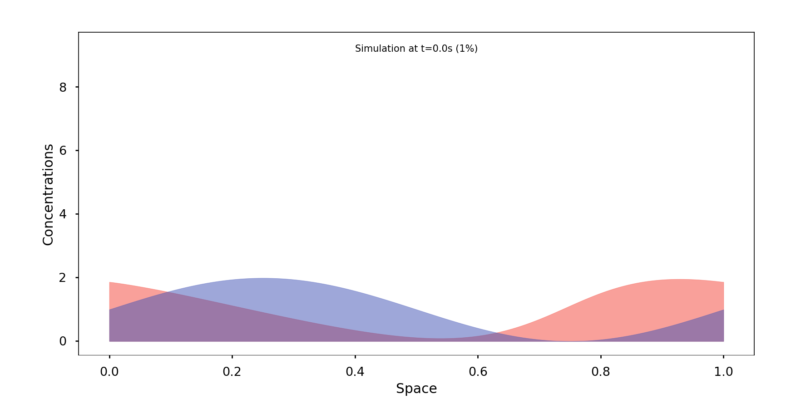
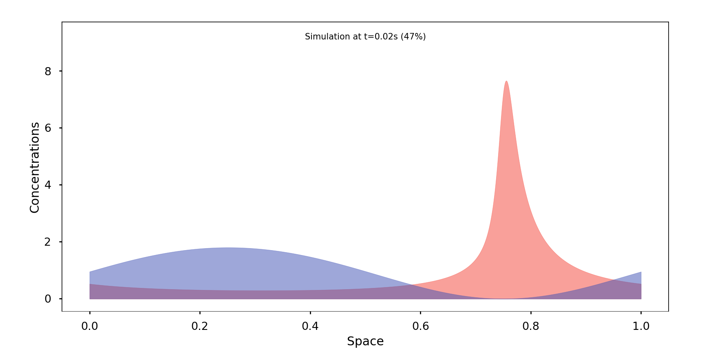
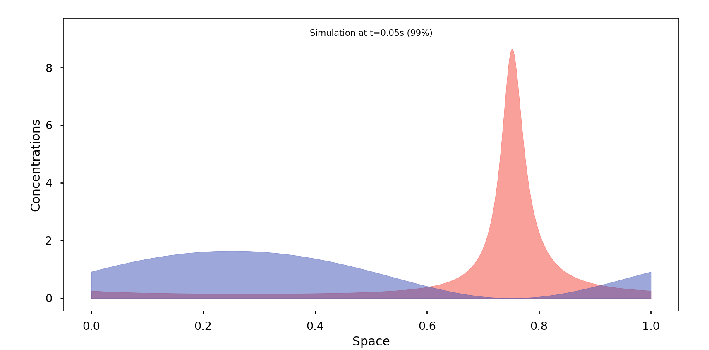
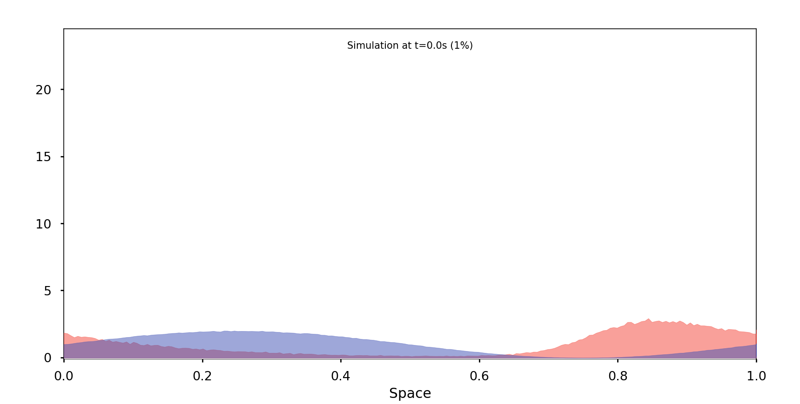
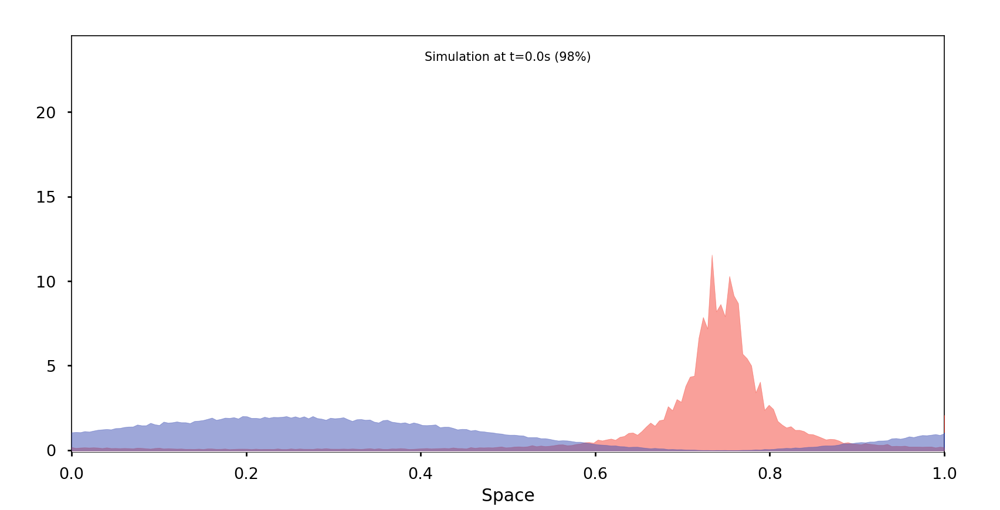

# PSC MArkov Stochastics

Stochastic simulation of advanced 1D population dynamics, based on the Sheguesada Kawazaki Teramoto (SKT) model.
In this project, we comparearively solved the SKT model system for stationary solutions using stochastic simulations and deterministic methods. [[Theory and Results Presetation (French)]](./misc/PSC.pdf))

 

## Benchmark

As a benchmark, the simulation hereunder represents the population dynamics stationary and deterministic solution.

## Results

Comparative observations:

First deterministic:

Then stochastic:

