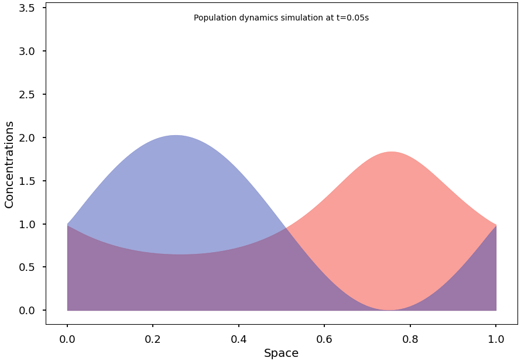

# PSC MArkov Stochastics

Capstone project at Ecole Polytechnique with Theo Molfessis, Samuel Boïté, Mathias Grau and Paco Goze.

Stochastic simulation of advanced 1D population dynamics, based on the Sheguesada Kawazaki Teramoto (SKT) model. 


## Benchmark

As a benchmark, we also simulated the continuous stationary solved solutions of the equation system hereunder ([[Theory (French)]](./misc/theory.pdf))




That you can obtain with quickstart code:

```python
import numpy as np
from pyspecies import pop, models

q = pop.Pop(
    space=(0, 1, 200),  # lower bound, upper bound, number of points
    u0=lambda x: 1 + np.cos(2 * np.pi * x),
    v0=lambda x: 1 + np.sin(2 * np.pi * x),
    model=models.SKT(
        D=np.array([[5e-3, 0, 3], [5e-3, 0, 0]]),
        R=np.array([[5, 3, 1], [2, 1, 3]])
    ),
)

# Simulate with increasing speeds
for i in range(-2, 2):
    q.sim(duration=2*10**i, N=100)

# Animate the result
q.anim()
```

And this renders a cyclic solution of the Lotka-Volterra equations:

```python
p = pop.Pop(
    space = (0, 1, 10),
    u0 = lambda x: 1 + 0*x,  # IC for prey
    v0 = lambda x: 1 + 0*x,  # IC for predator
    model = models.LV(1.1, 0.4, 0.4, 0.1)
)

p.sim(duration=20, N=200)
p.sim(duration=100, N=200)
p.anim()
```
